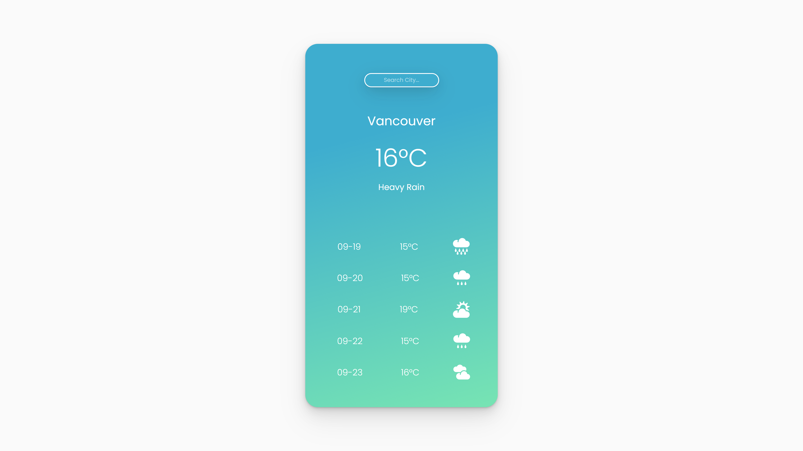
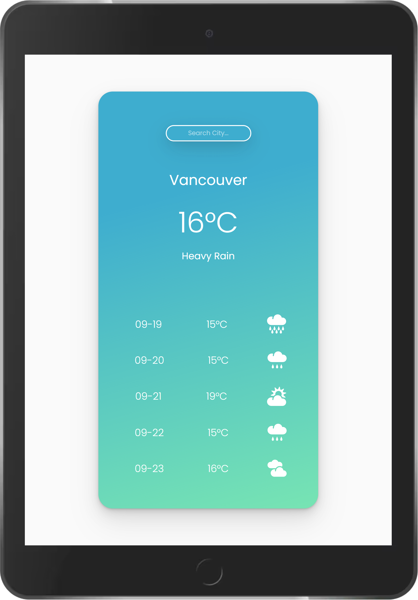

<h1 align="center"> Weather App   (Mobile App) </h1>

<i>A vanilla JS minimalist weather mobile app with city name search feature.</i>

## Table of Contents

- [Live Demo](#live-demo)
- [Description](#description)
- [Tech Stack](#tech-stack)
- [Key Features](#key-features)
- [Future Scope](#future-scope)

## Live Demo

<h2 align="center"><a  href="https://ll-weather-app.netlify.app/">Live Demo Link</a></h2>

|                                            Mobile View                                            |                                     Tablet View                                      |
| :-----------------------------------------------------------------------------------------------: | :----------------------------------------------------------------------------------: |
|  |  |

## Description

A vanilla JS minimalist weather mobile app with city name search feature.

This app is powered by [MetaWeather API](https://www.metaweather.com/), deployed on Netlify.

<!-- =============================================== -->

## Tech Stack

#### Frontend:

- HTML5
- CSS3
- Javascript(ES6)

#### Development:

- GIT - for version control
- Bash - for CLI
<!-- =============================================== -->

## Key Features

- Fetch data from REST API
- Search with city name
- Weather forecast for next 5 days
- SVG icon weather display
- Elegant UI
- Minimalist design
- Mobile APP

## Future Scope

- World cities suggestion
- Auto location
- Unit Switch (C/F)
